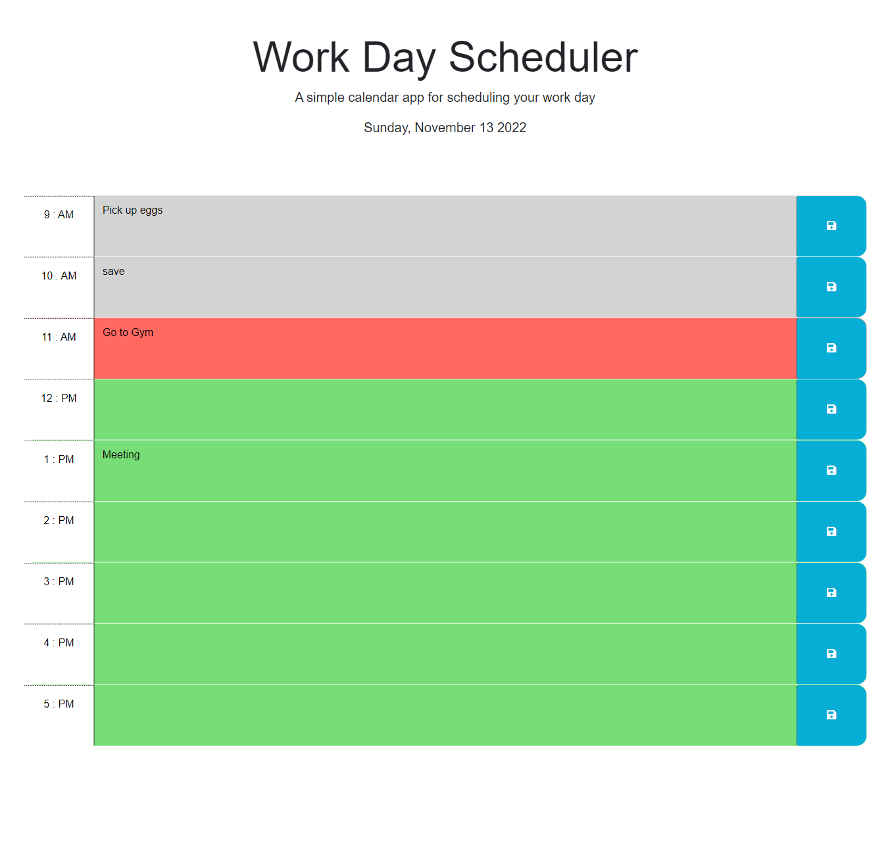

# Work-day-Scheduler

## Description

The motivation for the project was to solve the problem of organizing a workers day. The scheduler feature dynamically updated HTML and CSS powered by jQuery and DayJs libray.

Worker can save events for each hour of the day using time blocks. Each timeblock is color coded:

- Red : Present
- Green: Future
- Gray: Past

When user clicks in time block they and add edit and save events to the daily planner.
The events are saved in local storage so if the user refreshes the page then the saved events persist.

[github URL:](https://github.com/DexterDick/work-day-scheduler)

[github-pages URL:](https://dexterdick.github.io/work-day-scheduler/)

## Screenshot

;
